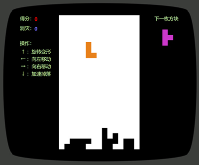
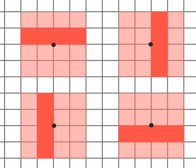
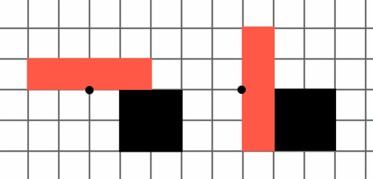

# 俄罗斯方块（tetris）

[请点击在线体验](https://itabbot.com/tetris/src/index.html)。

这是一款经典的俄罗斯方块网页小游戏，由 JavaScript + HTML + CSS 制作而成。同样是借助 `window.requestAnimationFrame()` 的能力运行游戏循环；基于 Web Canves API 封装了游戏的核心逻辑；结合特定的 Web Event 实现了与玩家的互动。

## 方块变形

大家都知道，方块的变形是围绕一个中心点顺时针旋转 90° 而成的，但是可能大部分人不清楚的是，这个旋转点大多数情况下并不是方块的中心点。如下图所示，一个 I 形方块，是围绕其腰部一侧边缘的点来旋转变形的。

另外，在“下一枚方块”区域，方块则是围绕方块自身的中心点来展示。

更加有趣的是，即使有障碍物卡住方块，使其看起来不能自由的旋转，但是只要目标位置没有被占用，方块仍然能够变换形状。因为方块的变形并不像客观的物体一样旋转，而是在瞬间由一个形状变换为另一个形状。如下图所示，即使有黑色方块的阻挡，I 形方块仍然能够变形，由左侧形状变换为右侧的形状。

